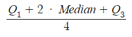

# Basic-Stats-Notes
# Basic Statistics Notes
### **Trimean**
**Dataset:** 10, 12, 15, 18, 21, 24, 27, 30, 33, 36, 39, 42, 45, 48, 50

**Solution:**

**1. Sort the dataset**
- As the dataset is already sorted, this step can be skipped.
10, 12, 15, 18, 21, 24, 27, 30, 33, 36, 39, 42, 45, 48, 50

**2. Find the median**
- The median is the value in the center, if the dataset is even, the mean of the two center values will be the median.
- In this case the median is 30.

10, 12, 15, 18, 21, 24, 27, **30**, 33, 36, 39, 42, 45, 48, 50

**3. Find the Q1 & Q3**

- Q1 is found by getting the median of each quartile.

Q1: 10, 12, 15, **18**, 21, 24, 27

Q3: 33, 36, 39, **42**, 45, 48, 50

**4. Calculate the trimean**

Trimean Formula:

